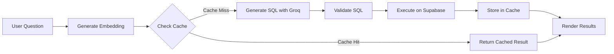

# 📊 DataChat — Natural Language to SQL with RAG

[](https://nextjs.org/)
[](https://supabase.com/)
[](https://www.typescriptlang.org/)
[](LICENSE)

DataChat is an AI-powered data analytics platform that enables users to interact with their data using natural language. Upload a CSV file, ask questions in plain English, and receive instant insights through automatically generated SQL queries, visualizations, and intelligent caching.


## ✨ Key Features

- **🗣️ Natural Language Querying** — Ask questions about your data in plain English
- **📤 CSV Upload** — Seamlessly upload and analyze CSV datasets
- **🔄 Automatic SQL Generation** — Powered by Groq's LLM for fast, accurate SQL conversion
- **📊 Smart Visualizations** — Interactive charts and tables using Recharts
- **🧠 RAG-based Semantic Cache** — Speed up similar queries using pgvector embeddings
- **💾 Conversation Memory** — Maintains context across multiple queries
- **🔒 SQL Validation** — Built-in safety checks for secure query execution
- **⚡ Real-time Execution** — Query results displayed instantly

## 🏗️ Architecture

```
User Query → Embedding → RAG Cache Check → SQL Generation (Groq) → Validation → Execution (Supabase) → Visualization
                ↓                                                           ↓
         Cache Hit (Fast)                                          Store in Cache
```

### Technology Stack

- **Frontend**: Next.js 14 (App Router), React, TailwindCSS, shadcn/ui
- **Backend**: Next.js API Routes, Supabase (PostgreSQL + pgvector)
- **AI/ML**: Groq LLM (SQL Generation), Ollama (Embeddings - nomic-embed-text)
- **Visualization**: Recharts
- **Database**: Supabase PostgreSQL with pgvector extension

## 👥 Team Members

| Name | Roll No. | Contribution |
|------|----------|--------------|
| **PIYUSH PRASHANT** | 24BDS055 | RAG Pipeline, Embeddings, Semantic Cache Implementation |
| **MS HARSHITHA** | 24BDS038 | Testing, Documentation, System Integration |
| **PRIYANSHU MITTAL** | 24BDS058 | Backend Development, Supabase Integration, Data Visualization |
| **JAKKUVA SAMEER** | 24BDS026 | Frontend UI/UX, Debugging, Component Development |

## 📁 Project Structure

```
DATACHAT_NL--SQL-MAIN/
├── app/                              # Next.js App Router
│   ├── api/
│   │   ├── chat/                     # Main NL → SQL chat endpoint
│   │   ├── upload-csv/               # CSV upload & table creation
│   │   └── ...
│   ├── layout.tsx                    # Root layout
│   ├── page.tsx                      # Main application page
│   └── globals.css                   # Global styles
│
├── components/                       # React Components
│   ├── chat-interface.tsx            # Main chat interface
│   ├── chat-message.tsx              # Individual message component
│   ├── results-table.tsx             # Query results table
│   ├── data-chart.tsx                # Chart visualizations
│   ├── csv-upload.tsx                # CSV upload component
│   └── ui/                           # shadcn/ui components
│
├── lib/                              # Core Backend Logic
│   ├── setup.ts                      # Database initialization
│   ├── embeddings.ts                 # Ollama embedding generation
│   ├── query-cache.ts                # Semantic cache with pgvector
│   ├── query-executor.ts             # SQL execution engine
│   ├── db.ts                         # Dynamic schema loading
│   ├── memory.ts                     # Conversation memory
│   ├── session.ts                    # Session management
│   ├── prompts.ts                    # LLM system prompts
│   ├── sql-validator.ts              # SQL safety validation
│   └── types.ts                      # TypeScript definitions
│
├── scripts/                          # Database Scripts
│   ├── 01-setup-database-functions.sql
│   ├── 02-reload-schema-cache.sql
│   ├── 03-conversation-memory.sql
│   └── conversation-query-cache.sql
│
├── .env.local                        # Environment configuration
├── env.example                       # Environment template
├── DEPLOYMENT.md                     # Deployment instructions
├── COMPLETE-PROJECT-SUMMARY.md       # Detailed project documentation
├── package.json
└── README.md
```

## 🚀 Getting Started

### Prerequisites

Before you begin, ensure you have the following installed:

- **Node.js** 18.x or higher ([Download](https://nodejs.org/))
- **npm** or **pnpm** (comes with Node.js)
- **Ollama** ([Installation Guide](https://ollama.com/))
- **Supabase Account** ([Sign Up](https://supabase.com/))
- **Groq API Key** ([Get API Key](https://console.groq.com/))

### Installation

#### 1. Clone the Repository

```bash
git clone https://github.com/yourusername/datachat-nl-sql.git
cd datachat-nl-sql
```

#### 2. Install Dependencies

Using npm:
```bash
npm install
```

Or using pnpm:
```bash
pnpm install
```

#### 3. Configure Environment Variables

Create a `.env.local` file in the root directory:

```env
# Supabase Configuration
NEXT_PUBLIC_SUPABASE_URL=https://your-project.supabase.co
NEXT_PUBLIC_SUPABASE_ANON_KEY=your-anon-key
SUPABASE_SERVICE_ROLE_KEY=your-service-role-key

# Groq API Configuration
GROQ_API_KEY=gsk_your_groq_api_key

# Embedding Configuration
EMBEDDING_MODEL=nomic-embed-text
EMBEDDING_DIM=768
```

**Getting Your Credentials:**

- **Supabase**: Go to your [Supabase Dashboard](https://app.supabase.com/) → Project Settings → API
- **Groq**: Visit [Groq Console](https://console.groq.com/) → API Keys

#### 4. Set Up Ollama

**Install Ollama:**

- **Windows**:
  ```bash
  winget install Ollama.Ollama
  ```

- **macOS**:
  ```bash
  brew install ollama
  ```

- **Linux**:
  ```bash
  curl -fsSL https://ollama.com/install.sh | sh
  ```

**Pull the Embedding Model:**
```bash
ollama pull nomic-embed-text
```

**Start Ollama Server:**
```bash
ollama serve
```

> **Note**: Keep Ollama running in a separate terminal window while using DataChat.

#### 5. Initialize Supabase Database

The application will automatically create the required tables and extensions on first run. Ensure your Supabase project has the `pgvector` extension enabled:

1. Go to your Supabase Dashboard
2. Navigate to **Database** → **Extensions**
3. Search for `pgvector` and enable it

#### 6. Start the Development Server

```bash
npm run dev
```

Open your browser and navigate to:
```
http://localhost:3000
```

## 📖 How to Use DataChat

### Step 1: Upload Your Dataset

1. Click on the **"Upload CSV"** button
2. Select a CSV file from your computer
3. Wait for the file to be processed and loaded into Supabase
4. You'll see a confirmation message with your table name

### Step 2: Ask Questions

Type natural language questions about your data:

**Examples:**
- "Show me all records"
- "What is the average salary by department?"
- "Find the top 5 customers by revenue"
- "How many orders were placed last month?"

### Step 3: View Results

Results are displayed in three formats:
- **📋 Table View**: Paginated data table
- **📊 Chart View**: Interactive visualizations (bar, line, stacked)
- **💬 Summary**: Natural language explanation

### Step 4: Explore Further

- Ask follow-up questions
- The system maintains conversation context
- Similar queries are cached for faster responses

## 🔧 System Workflow

### Query Processing Pipeline



### RAG Semantic Cache

The system uses pgvector to store question embeddings and find similar queries:

| Column | Type | Description |
|--------|------|-------------|
| `question` | text | Original natural language question |
| `normalized_sql` | text | Generated SQL query |
| `result_sample` | jsonb | Sample results (1-100 rows) |
| `row_count` | integer | Total number of rows |
| `question_embedding` | vector(768) | Question embedding vector |
| `session_id` | text | Session identifier |
| `table_name` | text | Target table name |

**Similarity Threshold**: 0.85 (configurable)

## 🎯 Key Features Explained

### 1. Intelligent SQL Generation

Powered by Groq's high-performance LLM models:
- Context-aware query generation
- Handles complex aggregations and joins
- Generates explanations alongside SQL

### 2. Semantic Caching

- Finds similar questions using cosine similarity
- Reduces LLM API calls
- Instant responses for repeated queries
- Configurable similarity threshold

### 3. SQL Validation

Built-in safety checks prevent:
- DROP/DELETE/TRUNCATE operations
- System table access
- SQL injection attempts
- Unauthorized schema modifications

### 4. Conversation Memory

- Maintains full conversation history
- Enables contextual follow-up questions
- Stored per session in Supabase

## 🎥 Demo Video

**Watch DataChat in action:**

[](https://drive.google.com/file/d/1sse8FFnlriYNVltsP1hpq3QQq2qXtd3b/view?usp=sharing)

**Demo Highlights:**
- CSV upload and table creation
- Natural language query examples
- SQL generation process
- Interactive data visualizations
- Semantic cache demonstration
- Follow-up question handling

## 🛠️ Development

### Available Scripts

| Command | Description |
|---------|-------------|
| `npm run dev` | Start development server |
| `npm run build` | Build for production |
| `npm start` | Start production server |
| `npm run lint` | Run ESLint |
| `npm run type-check` | Run TypeScript type checking |

### Environment Setup

Refer to `env.example` for all required environment variables.

## 🐛 Troubleshooting

### Common Issues

**Issue**: Ollama connection error
- **Solution**: Ensure Ollama is running (`ollama serve`)
- Check if the model is pulled (`ollama pull nomic-embed-text`)

**Issue**: Supabase connection failed
- **Solution**: Verify your `.env.local` credentials
- Ensure pgvector extension is enabled

**Issue**: SQL execution error
- **Solution**: Check if the table exists
- Verify the SQL query syntax
- Review validation rules

**Issue**: Charts not rendering
- **Solution**: Ensure data has numeric columns
- Check browser console for errors

## 📝 Documentation

For more detailed information:
- [Complete Project Summary](COMPLETE-PROJECT-SUMMARY.md)
- [Deployment Guide](DEPLOYMENT.md)
- [API Documentation](docs/API.md)

## 🤝 Contributing

Contributions are welcome! Please feel free to submit a Pull Request.

1. Fork the repository
2. Create your feature branch (`git checkout -b feature/AmazingFeature`)
3. Commit your changes (`git commit -m 'Add some AmazingFeature'`)
4. Push to the branch (`git push origin feature/AmazingFeature`)
5. Open a Pull Request

## 📄 License

This project is licensed under the MIT License - see the [LICENSE](LICENSE) file for details.

## 🙏 Acknowledgments

- **Groq** for lightning-fast LLM inference
- **Supabase** for PostgreSQL and pgvector support
- **Ollama** for local embedding generation
- **Next.js** team for the excellent framework
- **shadcn/ui** for beautiful UI components

## 📧 Contact

For questions or support, please reach out to the team:

- **Project Lead**: Priyanshu Mittal


---

<div align="center">
  <strong>Built with ❤️ by Team DataChat</strong>
  <br>
  <sub>Making data analysis accessible through natural language</sub>
</div>
